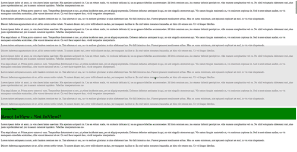

# React Inview

Checks if component is inview. Built with vanilla javascript.

Currently in beta, please help contribute!



## Installation

Requires [nodejs](http://nodejs.org/).

```sh
npm install react-inview-js
```
## Options

* showGuides: creates visual indicator of viewport size
* offsetY: range 0 to 1. changes how large the viewport should be. Defaults to 0 which is the full size of browser. 
* fullElementInView: boolean(true/false) - false means just the top of the element is in view - good for large elements

## Received Props
*this.props.elementIsInView: True/false value based on if element is in view
*this.props.elementHasBeenInView: True/false if the element has been in view

## How To Use

```javascript
import React, { Component } from 'react';
import ReactInview from 'react-inview-js';

class MyComponent extends Component {

 render () {
    const inView = this.props.elementIsInView;

    // Change classname based on boolean
    const viewClassName = (inView)? 'is--inview-true' : 'is--inview-false';

    return (
      <article className={viewClassName}>
        <h1>React InView</h1>
      </article>
    );
  }
}

const InviewOptions = {offsetY: 0.8, showGuides: true, fullElementInView: false}

export default ReactInview(InviewOptions)(MyComponent);

```
## Example

```
npm install && npm install react react-dom && npm start
```
